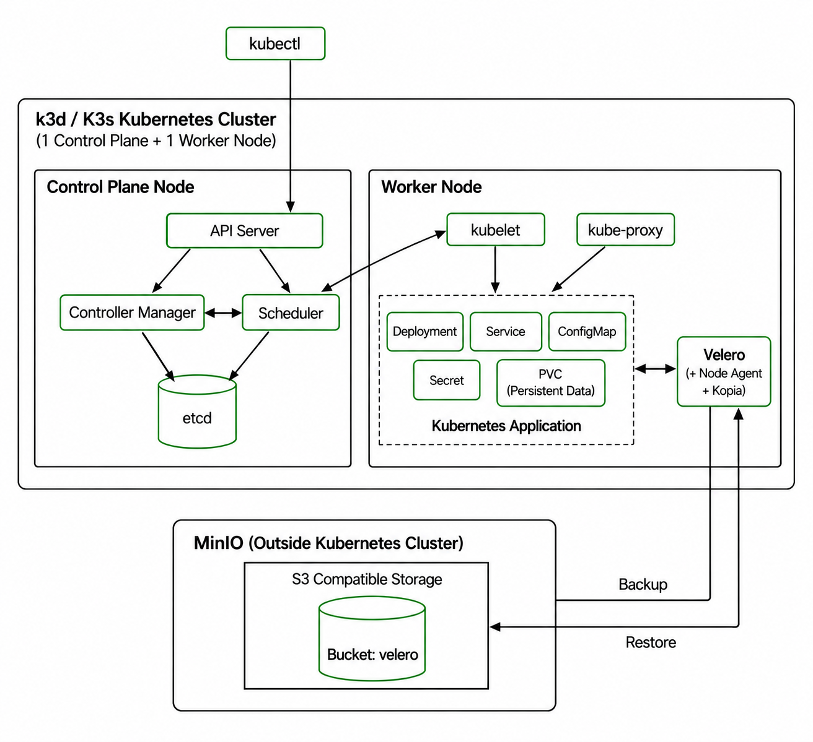

# velero-disaster-recovery-lab

# Kubernetes Backup & Disaster Recovery Using Velero

## Overview

This project demonstrates Kubernetes backup and disaster recovery using **Velero** and **MinIO**.

The lab was created on a local Windows machine using a **two-node k3d/K3s Kubernetes cluster** with:

- 1 Control Plane Node
- 1 Worker Node

A sample Kubernetes application was deployed with a Deployment, Service, ConfigMap, Secret, and PersistentVolumeClaim (PVC).

Important data was written to the persistent volume and protected using Velero.

MinIO was running **outside the Kubernetes cluster** and was used as the S3-compatible backup storage. This allows the backup to remain available even when the Kubernetes cluster is deleted.

Two disaster recovery scenarios were tested:

1. Namespace deletion and recovery
2. Complete Kubernetes cluster deletion, recreation, and recovery

Both scenarios successfully recovered the Kubernetes resources and the original persistent data.

---

## Project Architecture



### Architecture Flow

```text
Local Windows Machine
        |
        +---------------------------+
        |                           |
        v                           v
  k3d/K3s Cluster                 MinIO
        |                    External Storage
        |                           |
        |                      velero bucket
        |
        +-- Kubernetes Application
        |       |
        |       +-- Deployment
        |       +-- Service
        |       +-- ConfigMap
        |       +-- Secret
        |       +-- PVC
        |              |
        |              +-- Persistent Data
        |
        +-- Velero
               |
               +-- Node Agent
               +-- Kopia
               |
               +---- Backup ----> MinIO
               |
               <---- Restore ---- MinIO
```

---

## Tools and Technologies

- Kubernetes
- k3d
- K3s
- kubectl
- Velero
- Velero Node Agent
- Kopia
- MinIO
- Docker Desktop
- Git / GitHub

---

## Kubernetes Cluster

The lab used a local k3d cluster named:

```text
velero-lab
```

The cluster contained:

```text
1 Control Plane Node
1 Worker Node
```

The cluster was verified using:

```bash
kubectl get nodes
```

Both nodes were confirmed to be in the `Ready` state.

---

## MinIO Backup Storage

MinIO was configured outside the Kubernetes cluster as the backup repository.

The Velero backup bucket was:

```text
velero
```

MinIO provided S3-compatible object storage for Velero.

The MinIO data was stored on the host machine so that the backup repository remained available even after the Kubernetes cluster was deleted.

Credentials were stored securely and were not committed to GitHub.

---

## Velero Configuration

Velero was installed in the:

```text
velero
```

namespace.

Velero was configured to use MinIO as its S3-compatible backup storage.

Persistent data protection was enabled using:

```text
Velero Node Agent
Kopia
```

The installation was verified using:

```bash
kubectl get pods -n velero
velero backup-location get
```

The BackupStorageLocation was confirmed to be available before creating the backup.

---

## Test Application

The test application was deployed in the namespace:

```text
velero-lab
```

The application contained:

```text
Namespace
Deployment
Service
ConfigMap
Secret
PersistentVolumeClaim
```

The application mounted the PVC at:

```text
/data
```

A unique file was created inside the persistent volume:

```text
/data/important-data.txt
```

The file was used to verify that the actual persistent data was recovered after disaster recovery.

---

## Pre-Backup Validation

Before creating the backup, the application resources were checked:

```bash
kubectl get all -n velero-lab
kubectl get pvc -n velero-lab
kubectl get configmap -n velero-lab
kubectl get secret -n velero-lab
```

The persistent data was also verified:

```bash
kubectl exec -n velero-lab deployment/velero-lab-app -- cat /data/important-data.txt
```

The original file content was recorded before the backup so it could be compared after restoration.

---

## Velero Backup

The backup was created with the name:

```text
velero-lab-backup-01
```

The backup was inspected using:

```bash
velero backup get
velero backup describe velero-lab-backup-01 --details
velero backup logs velero-lab-backup-01
```

The persistent volume data was also verified in the backup.

The final backup included the persistent data using Velero's Node Agent/Kopia file-system backup.

---

# Disaster Recovery Test 1 - Namespace Deletion

The first disaster scenario simulated the loss of the application namespace.

The namespace was deleted:

```bash
kubectl delete namespace velero-lab
```

The application resources were removed from the cluster.

The application was then restored from the existing Velero backup:

```bash
velero restore create velero-lab-restore-01 --from-backup velero-lab-backup-01
```

The restore was checked using:

```bash
velero restore get
velero restore describe velero-lab-restore-01 --details
```

The Kubernetes resources were verified:

```bash
kubectl get all -n velero-lab
kubectl get pvc -n velero-lab
```

Finally, the original persistent data was checked:

```bash
kubectl exec -n velero-lab deployment/velero-lab-app -- cat /data/important-data.txt
```

The original data was recovered successfully.

### Result

**Disaster Recovery Test 1: PASSED**

The namespace, application resources, PVC, and original persistent data were successfully restored.

---

# Disaster Recovery Test 2 - Complete Cluster Loss

The second disaster scenario simulated a complete Kubernetes cluster failure.

The existing MinIO backup storage was kept running because it was outside the Kubernetes cluster.

The original Kubernetes cluster was completely deleted.

A new two-node k3d/K3s cluster was then created with:

```text
1 Control Plane Node
1 Worker Node
```

Velero was installed again on the new cluster and configured to use the same existing MinIO backup repository.

The previous backup was discovered using:

```bash
velero backup get
```

The existing backup:

```text
velero-lab-backup-01
```

was successfully visible from the new cluster.

The application was restored:

```bash
velero restore create velero-lab-restore-02 --from-backup velero-lab-backup-01
```

The restore was verified:

```bash
velero restore get
velero restore describe velero-lab-restore-02 --details
```

The Kubernetes resources were checked:

```bash
kubectl get all -n velero-lab
kubectl get pvc -n velero-lab
```

The original persistent data was then verified:

```bash
kubectl exec -n velero-lab deployment/velero-lab-app -- cat /data/important-data.txt
```

The original data was recovered successfully on the newly created cluster.

### Result

**Disaster Recovery Test 2: PASSED**

The application and its original persistent data were successfully recovered even though the original Kubernetes cluster had been completely deleted.

---

# Scheduled Backup

After completing both disaster recovery tests, a daily Velero backup schedule was configured.

The schedule was:

```text
Daily
Retention: 7 days
```

The schedule was created using:

```bash
velero schedule create velero-lab-daily --schedule="0 2 * * *" --ttl 168h
```

The schedule was verified using:

```bash
velero schedule get
```

The schedule was enabled with a retention period of 168 hours, which is 7 days.

---

# Troubleshooting

During the lab, several issues were encountered and resolved.

### 1. Persistent Volume Was Not Included

The first backup completed, but the persistent volume data was not included because the volume was not opted in for the Velero Node Agent backup.

The deployment was updated with:

```text
backup.velero.io/backup-volumes: persistent-data
```

A new backup was then created and the persistent volume backup was successfully completed.

### 2. Node Agent Path Issue

After recreating the Kubernetes cluster, the Velero Node Agent initially had incorrect Windows-style host paths.

The paths were corrected to:

```text
/var/lib/kubelet/pods
/var/lib/kubelet/plugins
```

The Node Agent pods then started successfully.

### 3. Backup Storage Location

The Velero BackupStorageLocation was checked after installation to make sure that Velero could connect to the MinIO repository.

```bash
velero backup-location get
```

The backup location was confirmed as:

```text
Available
```

---

# Final Validation

The project successfully demonstrated:

- Two-node local Kubernetes cluster
- External MinIO backup storage
- Velero installation and configuration
- Kubernetes resource backup
- Persistent data backup
- Namespace deletion and recovery
- Complete Kubernetes cluster deletion
- New cluster creation
- Recovery from the existing MinIO backup
- Persistent data verification after recovery
- Daily backup schedule
- 7-day backup retention

---

# Final Result

The Kubernetes backup and disaster recovery workflow was successfully completed.

The most important validation was that the original persistent data was recovered successfully in both disaster scenarios.

This demonstrated that the application could be restored after:

1. Application namespace loss
2. Complete Kubernetes cluster loss

The external MinIO repository allowed the Velero backup to survive the complete deletion of the original Kubernetes cluster.

---

## Repository Structure

```text
velero-disaster-recovery-lab/
│
├── README.md
│
├── architecture/
│   └── architecture.png
│
├── kubernetes/
│   ├── namespace.yaml
│   ├── deployment.yaml
│   ├── service.yaml
│   ├── configmap.yaml
│   ├── secret-example.yaml
│   └── pvc.yaml
│
├── velero/
│   ├── installation-notes.md
│   ├── backup-commands.md
│   ├── restore-commands.md
│   └── schedule.md
│
├── evidence/
│   ├── before-backup/
│   ├── after-delete/
│   ├── after-restore/
│   └── new-cluster-restore/
│
└── report/
    └── velero-disaster-recovery-report.md
```

---

## Security

The repository does not contain:

- MinIO passwords
- MinIO secret keys
- Kubernetes credentials
- Kubeconfig files
- Cloud credentials
- Access tokens
- Other sensitive information

Example configuration files should be used instead of committing real credentials.
